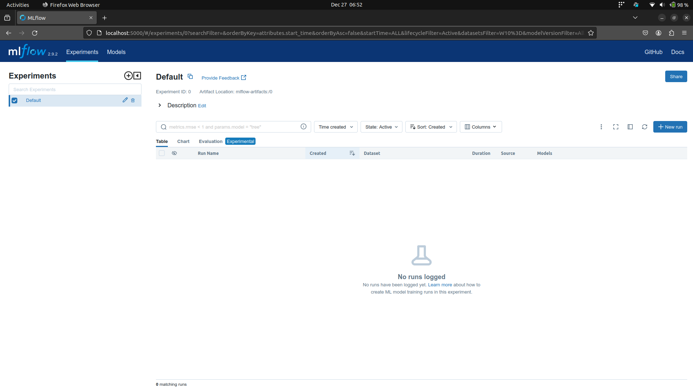

# MLFlow - Tracking and Managing ML Experiments and Models

# Overview
## What is MLFlow?
[MLFlow](https://mlflow.org/) is an open-sourced, machine learning development tool that provides the end users with the capability of tracking their experiment metrics and parameters across multiple runs and it also gives the ability to manage and version developed models using their model registry. The core principle behind this is to enable developers to experiment rapidly with their models and at the same time keep track of their progress more efficiently.

## Why use MLFlow?
At the beginning of a machine learning project, we've all made the choice of logging our experiments and our results using excel sheets or sometimes, if you are feeilng too adventurous, even a peice of paper. However, as the complexity of the development increases i.e same model being tried out with different parameters, introduction of new evaluation metrics and trying out different models. It becomes really messy to keep track of everything from parameters to metrics to the models that were developed. MLFlow solves this exact problems and adds complete visibility within your machine learning development workflow.

MLFlow is also an easy to use tool. With a simple setup and a couple of API calls, one can log models, parameters and metrics. Visulizing results and registering models to the registry is also achieved in a few clicks.

# Setup
> [!WARNING]
> This tutorial contains implemetation and setup of MLFlow using Python. For parallel implementations in other languages, please refer to the [official docs](https://mlflow.org/docs/latest/index.html).

> [!NOTE]
> All the code refered to in this blog can be found in [this repository](https://github.com/vimalsheoran/learn-mlflow),

## MLFlow Setup Steps
1. Create a virtual environment. I prefer `virtualenv` so I'll be using it.

    `$ virtualenv venv`
2. Activate your virtual environment.

    `$ source venv/bin/activate`
3. Install MLFlow.

    `$ pip install mlflow`
4. Run MLFlow's application server to test for successful install.

    `$ mlflow ui`

If the following commands execute successfully, you should be able to see the MLFlow service running on `http://localhost:5000`,

